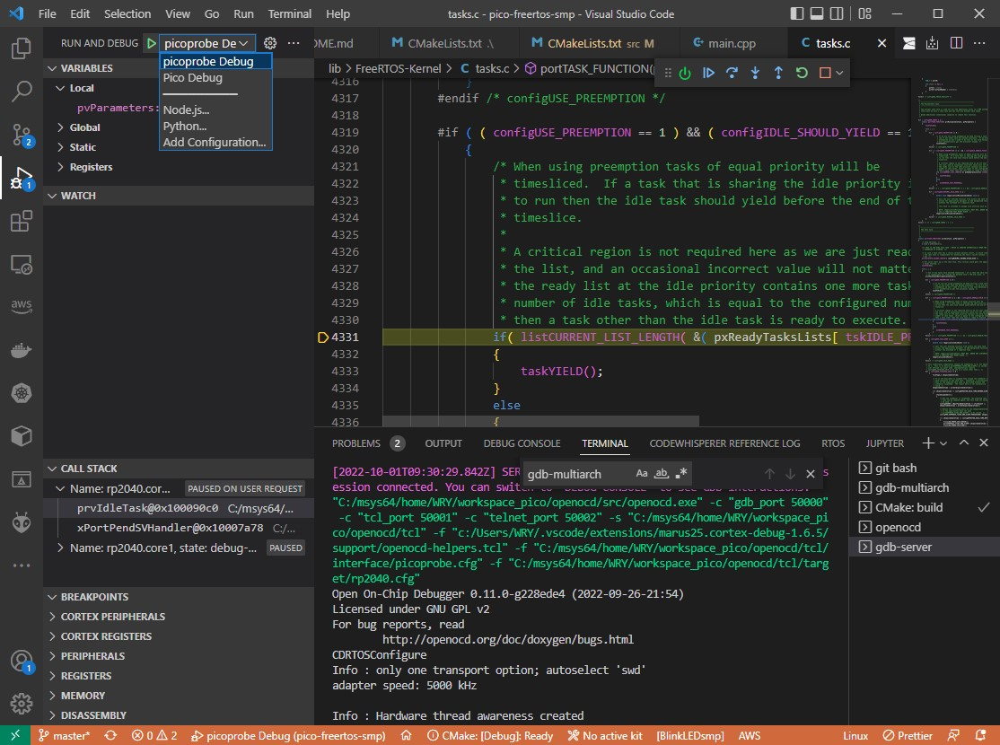
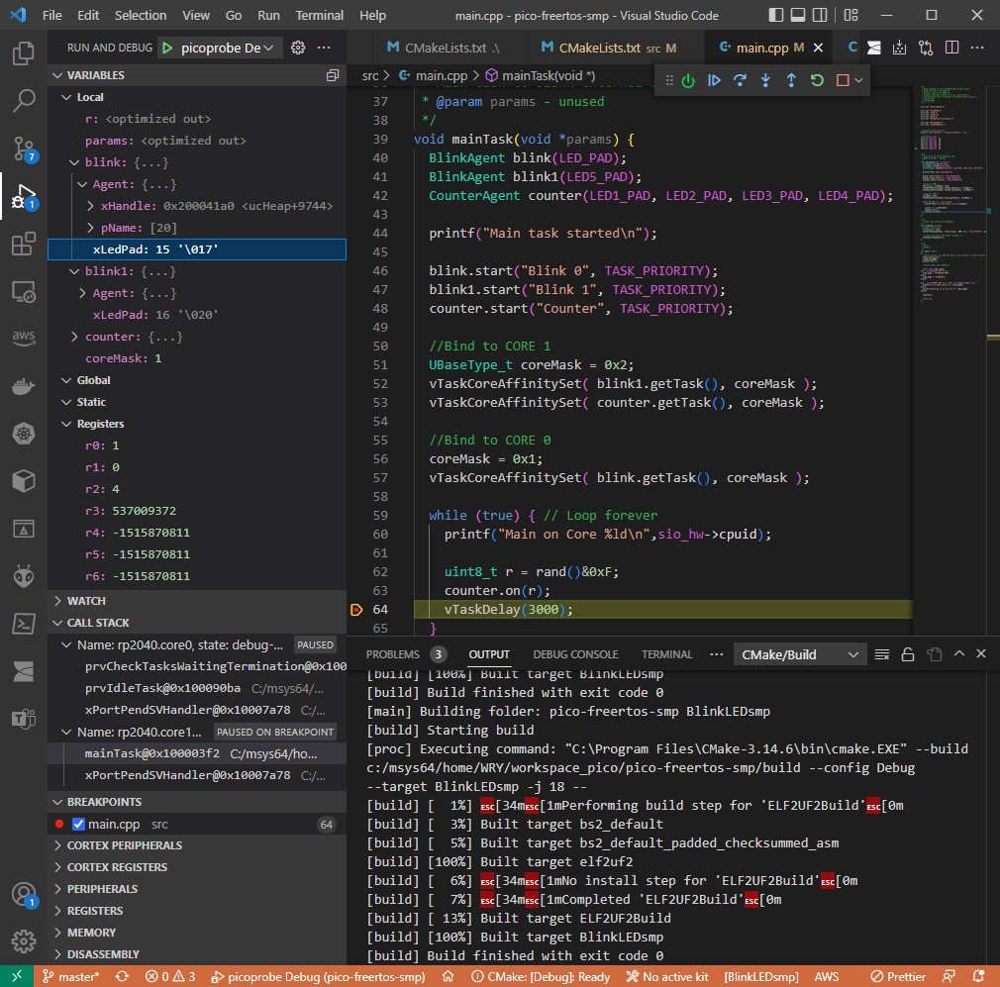
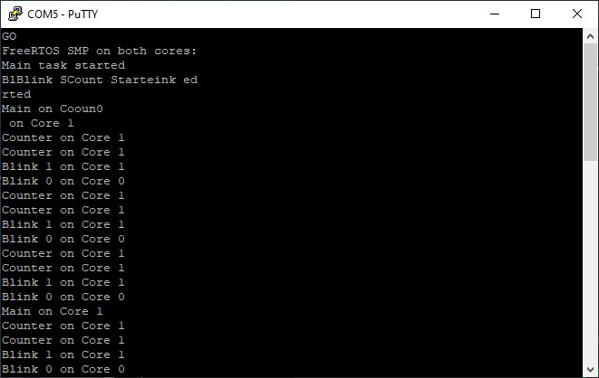

# pico-freertos-smp

FreeRTOS Kernel SMP for the Raspberry Pi Pico.

* [Video Tutorial](https://youtu.be/nD8XeWjn-2w)
* [sample github](https://github.com/jondurrant/RPIPicoFreeRTOSSMPExp)
* [FreeRTOS SMP Docs](https://www.freertos.org/symmetric-multiprocessing-introduction.html)

## 1. Setup

```sh
$ mkdir pico-freertos-smp
$ cd pico-freertos-smp/
$ git init
$ git submodule add https://github.com/FreeRTOS/FreeRTOS-Kernel
$ cd FreeRTOS-Kernel/
$ git checkout V202110.00-SMP
$ cd ..
$ mkdir lib
$ mv FreeRTOS-Kernel lib/

# modify the git module's path
$ vi .gitmodules

# cmake presets
$ export PICO_SDK_PATH=~/workspace_pico/pico-sdk
$ export PICO_TOOLCHAIN_PATH=/c/Program\ Files\ \(x86\)/Arm\ GNU\ Toolchain\ arm-none-eabi/12.2\ mpacbti-bet1/bin
$ export PICO_PLATFORM=rp2040
$ export FREERTOS_KERNEL_PATH=~/workspace_pico/pico-freertos-smp/lib/FreeRTOS-Kernel

# import pico sdk
$ cp $PICO_SDK_PATH/external/pico_sdk_import.cmake ./

# import FreeRTOS-SMP
$ cp lib/FreeRTOS-Kernel/portable/ThirdParty/GCC/RP2040/FreeRTOS_Kernel_import.cmake ./
# fix the FREERTOS_KERNEL_RP2040_RELATIVE_PATH
$ vi lib/FreeRTOS-Kernel/portable/ThirdParty/GCC/RP2040/FreeRTOS_Kernel_import.cmake
$ diff FreeRTOS_Kernel_import.cmake lib/FreeRTOS-Kernel/portable/ThirdParty/GCC/RP2040/FreeRTOS_Kernel_import.cmake 
11,13d10
< else ()
<       set(FREERTOS_KERNEL_PATH "${CMAKE_CURRENT_LIST_DIR}/lib/FreeRTOS-Kernel")
<     message("Using local FREERTOS_KERNEL_PATH '${FREERTOS_KERNEL_PATH}')")
18,19c15
< # set(FREERTOS_KERNEL_RP2040_BACK_PATH "../../../..")
<
---
> set(FREERTOS_KERNEL_RP2040_BACK_PATH "../../../..")
66,69c62
< add_subdirectory(${FREERTOS_KERNEL_PATH}/${FREERTOS_KERNEL_RP2040_RELATIVE_PATH} FREERTOS_KERNEL)
<
< #FORCE LIBRARY BUILD
< include(${FREERTOS_KERNEL_PATH}/${FREERTOS_KERNEL_RP2040_RELATIVE_PATH}/library.cmake)
---
> add_subdirectory(${FREERTOS_KERNEL_PATH}/${FREERTOS_KERNEL_RP2040_RELATIVE_PATH} FREERTOS_KERNEL)
\ No newline at end of file
```

## 2. Build the solution

Open the *msys mingw64* terminal:


```sh
$ rm -rf build/
$ mkdir build
$ cd build/
$ cmake --version
cmake version 3.24.2

$ cmake -G "MSYS Makefiles" -DCMAKE_BUILD_TYPE=Debug ..
Using PICO_SDK_PATH from environment ('C:/msys64/home/WRY/workspace_pico/pico-sdk')
PICO_SDK_PATH is C:/msys64/home/WRY/workspace_pico/pico-sdk
Using PICO_PLATFORM from environment ('rp2040')
Defaulting PICO platform compiler to pico_arm_gcc since not specified.       
PICO compiler is pico_arm_gcc
-- The C compiler identification is GNU 12.2.0
-- The CXX compiler identification is GNU 12.2.0
-- The ASM compiler identification is GNU
-- Found assembler: C:/Program Files (x86)/Arm GNU Toolchain arm-none-eabi/12.2 mpacbti-bet1/bin/arm-none-eabi-gcc.exe
Build type is Debug
Using regular optimized debug build (set PICO_DEOPTIMIZED_DEBUG=1 to de-optimize)
Defaulting PICO target board to pico since not specified.
Using board configuration from C:/msys64/home/WRY/workspace_pico/pico-sdk/src/boards/include/boards/pico.h
-- Found Python3: C:/msys64/mingw64/bin/python3.10.exe (found version "3.10.7") found components: Interpreter
TinyUSB available at C:/msys64/home/WRY/workspace_pico/pico-sdk/lib/tinyusb/src/portable/raspberrypi/rp2040; enabling build support for USB.
Compiling TinyUSB with CFG_TUSB_DEBUG=1
cyw43-driver available at C:/msys64/home/WRY/workspace_pico/pico-sdk/lib/cyw43-driver
lwIP available at C:/msys64/home/WRY/workspace_pico/pico-sdk/lib/lwip
Using FREERTOS_KERNEL_PATH from environment ('C:/msys64/home/WRY/workspace_pico/pico-freertos-smp/lib/FreeRTOS-Kernel')
-- Configuring done
-- Generating done
-- Build files have been written to: C:/msys64/home/WRY/workspace_pico/pico-freertos-smp/build

$ make -j8
```

## 3. Run debugger `gdb-multiarch`

```sh
# gdb-server -> openocd on separate shell
$ cd ~/workspace_pico/openocd
$ src/openocd.exe -f tcl/interface/picoprobe.cfg -f tcl/target/rp2040.cfg -s tcl

# run gdb on the current directory
MINGW64 ~/workspace_pico/pico-freertos-smp/build
$ gdb-multiarch.exe src/BlinkLEDsmp.elf
(gdb) break main
Breakpoint 1 at 0x1000033c: file C:/msys64/home/WRY/workspace_pico/pico-freertos-smp/src/main.cpp, line 93.
(gdb) target remote localhost:3333
Remote debugging using localhost:3333
warning: A handler for the OS ABI "Windows" is not built into this configuration
of GDB.  Attempting to continue with the default armv6s-m settings.

warning: multi-threaded target stopped without sending a thread-id, using first non-exited thread
Note: automatically using hardware breakpoints for read-only addresses.
0x100083d4 in prvMinimalIdleTask (pvParameters=<optimized out>) at C:/msys64/home/WRY/workspace_pico/pico-freertos-smp/lib/FreeRTOS-Kernel/tasks.c:4249
4249                        if( listCURRENT_LIST_LENGTH( &( pxReadyTasksLists[ tskIDLE_PRIORITY ] ) ) > ( UBaseType_t ) configNUM_CORES )
(gdb) load
Loading section .boot2, size 0x100 lma 0x10000000
Loading section .text, size 0x9e30 lma 0x10000100
Loading section .rodata, size 0x295c lma 0x10009f30
Loading section .binary_info, size 0x20 lma 0x1000c88c
Loading section .data, size 0x93c lma 0x1000c8ac
Start address 0x100001e8, load size 53736
Transfer rate: 17 KB/sec, 7676 bytes/write.
(gdb) continue
Continuing.
target halted due to debug-request, current mode: Thread 
xPSR: 0x01000000 pc: 0x00000184 msp: 0x20041f00

Thread 1 hit Breakpoint 1, main () at C:/msys64/home/WRY/workspace_pico/pico-freertos-smp/src/main.cpp:93
93              const char *rtos_name;
(gdb) c
Continuing.

(Ctrl-C to stop)
(gdb) disconnect
(gdb) quit

```

## 4. VSCode Debugger




Progress on the console:


Console:


```sh
GO
FreeRTOS SMP on both cores:
Main task started
BlBlink SCount Starteinktet
t

Main on Coreunt
               r on Core 1
Counter on Core 1
Counter on Core 1
Blink 1 on Core 1
Blink 0 on Core 0
Counter on Core 1
Counter on Core 1
Blink 1 on Core 1
Blink 0 on Core 0
Counter on Core 1
Counter on Core 1
Blink 1 on Core 1
Blink 0 on Core 0
Main on Core 1
Counter on Core 1
Counter on Core 1
Blink 1 on Core 1
Blink 0 on Core 0
Counter on Core 1
Counter on Core 1
Blink 1 on Core 1
Blink 0 on Core 0
Counter on Core 1
Counter on Core 1
Blink 1 on Core 1
Blink 0 on Core 0
Counter on Core 1
Main on Core 1
```