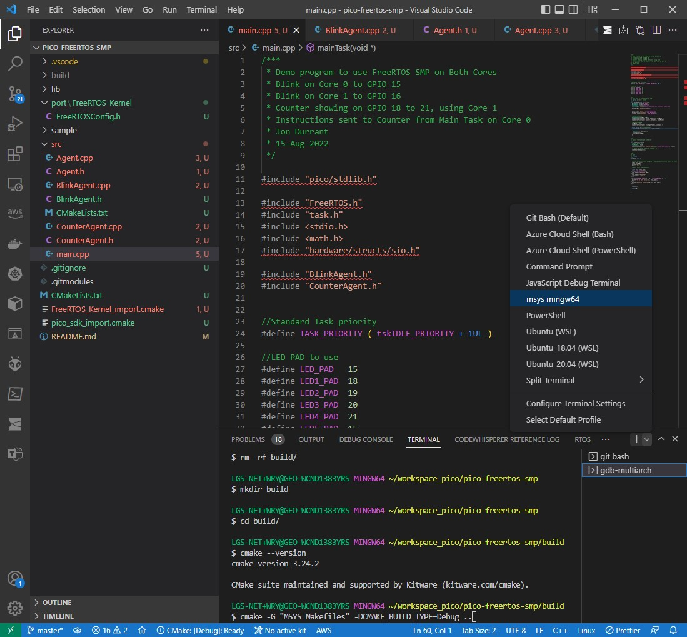

# pico-freertos-smp

FreeRTOS Kernel SMP for the Raspberry Pi Pico.

* [Video Tutorial](https://youtu.be/nD8XeWjn-2w)
* [sample github](https://github.com/jondurrant/RPIPicoFreeRTOSSMPExp)
* [FreeRTOS SMP Docs](https://www.freertos.org/symmetric-multiprocessing-introduction.html)

## 1. Setup

```sh
$ mkdir pico-freertos-smp
$ cd pico-freertos-smp/
$ git init
$ git submodule add https://github.com/FreeRTOS/FreeRTOS-Kernel
$ cd FreeRTOS-Kernel/
$ git checkout V202110.00-SMP
$ cd ..
$ mkdir lib
$ mv FreeRTOS-Kernel lib/

# modify the git module's path
$ vi .gitmodules

# cmake presets
$ export PICO_SDK_PATH=~/workspace_pico/pico-sdk
$ export PICO_TOOLCHAIN_PATH=/c/Program\ Files\ \(x86\)/Arm\ GNU\ Toolchain\ arm-none-eabi/12.2\ mpacbti-bet1/bin
$ export PICO_PLATFORM=rp2040
$ export FREERTOS_KERNEL_PATH=~/workspace_pico/pico-freertos-smp/lib/FreeRTOS-Kernel

# import pico sdk
$ cp $PICO_SDK_PATH/external/pico_sdk_import.cmake ./

# import FreeRTOS-SMP
$ cp lib/FreeRTOS-Kernel/portable/ThirdParty/GCC/RP2040/FreeRTOS_Kernel_import.cmake
```

## 2. Build the solution

Open the *msys mingw64* terminal:


```sh
$ rm -rf build/
$ mkdir build
$ cd build/
$ cmake --version
cmake version 3.24.2

$ cmake -G "MSYS Makefiles" -DCMAKE_BUILD_TYPE=Debug ..
$ make -j8
```
